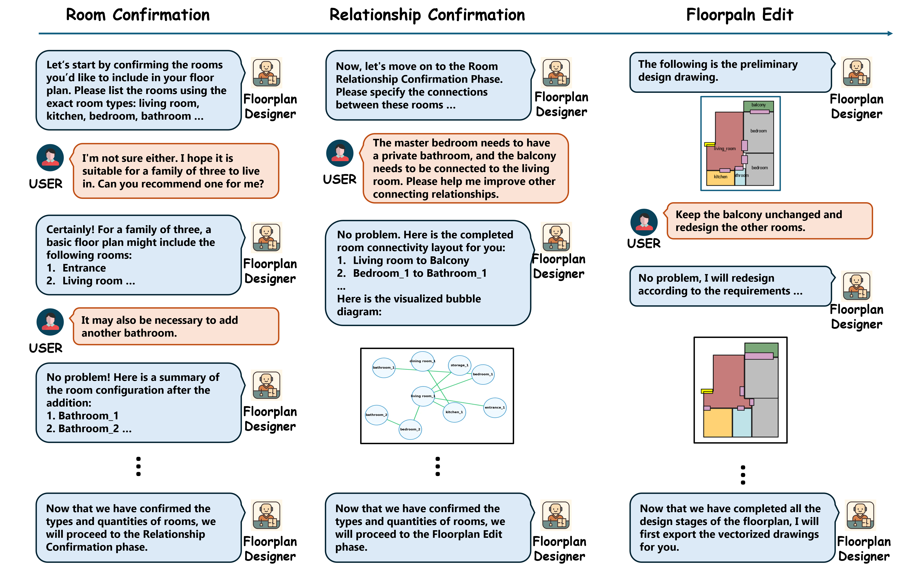

# ChatAssistDesign
**ChatAssistDesign: A Language-Interactive Framework for Iterative Vector Floorplan Generation via Conditional Diffusion**

## Installation
**1. Clone our repo and install the requirements:**

Our implementation is based on the public implementation of [house_diffusion](https://github.com/aminshabani/house_diffusion). For installation instructions, please refer to their repository. Keep in mind that our current version has not been cleaned and some features from the original repository may not function correctly.

```
git clone <repository_url>
cd house_diffusion
pip install -r requirements.txt
pip install -e .
```
**2. Download the dataset and create the datasets directory**

- **RPLAN dataset**: You can download the datasets from [RPLAN's website](http://staff.ustc.edu.cn/~fuxm/projects/DeepLayout/index.html) or by filling [this](https://docs.google.com/forms/d/e/1FAIpQLSfwteilXzURRKDI5QopWCyOGkeb_CFFbRwtQ0SOPhEg0KGSfw/viewform) form.
- We also use data preprocessing from House-GAN++ which you can find in [this](https://github.com/sepidsh/Housegan-data-reader) link.
- **MSD dataset**: Our code also supports the [MSD dataset](https://github.com/caspervanengelenburg/msd) (Modified Swiss Dwellings), which contains over 5.3K floor plans of medium- to large-scale building complexes. You can download the complete dataset from [Kaggle](https://www.kaggle.com/datasets).

Put all of the processed files from the downloaded dataset in a `datasets` folder in the current directory:

```
house_diffusion
├── datasets
│   ├── rplan
|   |   └── 0.json
|   |   └── 1.json
|   |   └── ...
|   └── ...
└── ConDiffPlan
└── scripts
└── ...
```

## Running the code

**1. Training**

You can run a single experiment using the following command:
```
python image_train.py --dataset rplan --batch_size 32 --set_name train --target_set 8
```
**2. Sampling**
To sample floorplans, you can run the following command from inside of the `scripts` directory. To provide different visualizations, please see the `save_samples` function from `scripts/image_sample.py`

```
python image_sample.py --dataset rplan --batch_size 32 --set_name eval --target_set 8 --model_path ckpts/exp/model250000.pt --num_samples 64
```
You can also run the corresponding code from `scripts/script.sh`.

**3. Floorplan Designer**

```
cd llm
python main.py
``` 
